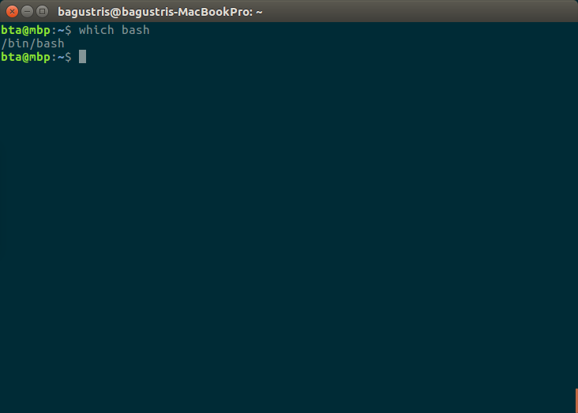

### Latar Belakang
Pada level tinggi, kompuer melakukan empat hal berikut:
1.  Menjalakankan program
2.  Menyimpan data
3.  Berkomunikasi dengan komputer dan perangkat lainnya, dan
4.  Berinteraksi dengan kita

Empat fungsi komputer tersebut dapat dilakukan dengan berbagai cara,
melalui divais input maupun output dari komputer, seperti mengetik,
menggambar, merekam video, menggunakan touchpad dan keyboards.

Cara paling konvensional berinteraksi dengan komputer adalah
melalui keyboard, meski teknonologi graphical user interface, **GUI**,
berkembang pesat sejak 1980-an. Salah satu akar kata GUI berasal dari film 
Doug Engelbar's pada tahun 1969 yang bisa dilihat pada link ini, 
"[The Mother of All Demos](http://www.youtube.com/watch?v=a11JDLBXtPQ)".

### The Command-Line Interface
Kembali pada tahun antara 1950 sampai tahun 1980,
satu-satunya cara interaksi manusia dengan komputer adalah
dengan **CLI**, command-line interface.
Maka setelah adanya **GUI** tahun 1980an, interface atau
antar muka komputer terbagi menjadi dua:

   - **command-line interface**, or CLI,
   - **graphical user interface**, or GUI,

Workflo dari CLI adalah **read-evaluate-print loop**, atau REPL:
artinya user ketika user mengetikkan perintah pada terminal
kemudian menekan enter (evaluate), maka komputer akan membaca perintah tersebut,
mengeksekusi dan menampilkan outpunya. Begitu seterusnya, **loop**, sampai
user keluar atau komputer dimatikan.

### The Shell
Dari penjelasan sebelumnya, user mengetikkan perintah kemudian outputnya akan muncul. 
Benarkah demikian? Ada perantara diantaranya yang dinamakan **command shell**.
Ketika user mengetikkan perintah, maka sebenarnya user mengetetikkan perintah shell
yang hanya bisa difahami oleh komputer jika perintah tersebut ada pada command shell tersebut.
Dinamakan shell karena melingkupi atau menghubungkan user dengan sistem operasi komputer.

Shell adalah program komputer sebagaimana program lainnya, yang paling banyak digunakan
adalah Bash, singkatan dari Bourne Again SHell yang diambil dari nama pembuatnya, Stephen Bourne.
Bash adalah shell default pada hampir semua Linux dan Unix modern. Selain bash ada jenis shell lainnya,
ksh, zsh dan csh.

### Why bother?
Kenapa memakai bash jika anda bisa tinggal klik sana-sini? Powerful. Bash sangat powerfull.
Ketika anda mengklik pada **GUI**, sebenarnya ada dua step yakni anda mengklik dan diterjemahkan 
oleh komputer yang biasanya berupa bash command.

Dengan menggunakan bash langsung anda akan lebih cepat dan pada kasus-kasus tertentu,
misal merename 100 file dalam satu folder, hanya bisa diselesaikan dengan bash shell.
Perhatikan contoh di bawah ini.

## Nelle's Pipeline: Starting Point

Nelle Nemo, a marine biologist,
has just returned from a six-month survey of the
[North Pacific Gyre](http://en.wikipedia.org/wiki/North_Pacific_Gyre),
where she has been sampling gelatinous marine life in the
[Great Pacific Garbage Patch](http://en.wikipedia.org/wiki/Great_Pacific_Garbage_Patch).
She has 1520 samples in all and now needs to:

1.  Run each sample through an assay machine
    that will measure the relative abundance of 300 different proteins.
    The machine's output for a single sample is
    a file with one line for each protein.
2.  Calculate statistics for each of the proteins separately
    using a program her supervisor wrote called `goostat`.
3.  Compare the statistics for each protein
    with corresponding statistics for each other protein
    using a program one of the other graduate students wrote called `goodiff`.
4.  Write up results.
    Her supervisor would really like her to do this by the end of the month
    so that her paper can appear in an upcoming special issue of *Aquatic Goo Letters*.

It takes about half an hour for the assay machine to process each sample.
The good news is that
it only takes two minutes to set each one up.
Since her lab has eight assay machines that she can use in parallel,
this step will "only" take about two weeks.

The bad news is that if she has to run `goostat` and `goodiff` by hand,
she'll have to enter filenames and click "OK" 46,370 times
(1520 runs of `goostat`, plus 300*299/2 (half of 300 times 299) runs of `goodiff`).
At 30 seconds each,
that will take more than two weeks.
Not only would she miss her paper deadline,
the chances of her typing all of those commands right are practically zero.

The next few lessons will explore what she should do instead.
More specifically,
they explain how she can use a command shell
to automate the repetitive steps in her processing pipeline
so that her computer can work 24 hours a day while she writes her paper.
As a bonus,
once she has put a processing pipeline together,
she will be able to use it again whenever she collects more data.

