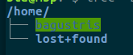
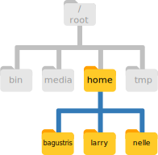

Bagian dari operating system untuk mengatur file dan direktori disebut **file system**.
File system (fs) mengorganisir data kita dalam files yang mengandung informasi dan direktori yang
berisi file atau direktori lainnya.

Beberapa perintah yang sering digunakan untuk membuat, menginspeksi, me-rename dan menghapus file dan direktoris
akan dijelaskan sebagai berikut. Tekan Ctrl+Alt+T untuk membuka terminal baru.

> ## Preparation Magic
>
> Jika anda mengetikkan:
> `PS1='$ '`
> pada shell kemudian diikuti `enter` maka jendela terminal anda akan terlihat
> seperti di contoh berikut. User biasa dilambangkan dengan dolar, `$`,
> sedangkan superuser dilambangkan dengan tanda pagar, `#`. 
{: .callout}

~~~
$
~~~
{: .bash}

Tanda dolar merupakan tanda **prompt**, yang menunjukkan kepada kita bahwa shell
sedang menunggu perihtan dari kita. Beberapa shell ataupun konsole/terminal dari perangkat lunak 
mungkin menggunakan tanda yang berbeda. Informasi sebelum **prompt**, *by default*, menunjukkan
posisi direktori kita saat ini.

Ketikkan pada shell `whoami`,
kemudian lihatlah apa yang terjadi. Dengan cara belajar seperti ini,
akan akan bisa meraba-raba, kira-kira perintah tersebut untuk apa.

~~~
$ whoami
~~~
{: .bash}

~~~
bagustris
~~~
{: .output}

Lebih spesifik, begini **algoritma**nya ketika mengetik `whoami` pada shell:

1.  Temukan program `whoami`,
2.  Jalankan program tersebut,
3.  Tampilkan output program
4.  Tampilkan **prompt** baru bahwa shell siap menerima perintah lagi.

> ## Variasi Username
>
> Pada lesson ini, `whoami` akan menampilkan akun user saya, yakni 'bagustris'. 
> Pada komputer anda dan komputer lainnya, hasilnya tertentu akan berbeda
> tergantung user siapa yang sedang login.
{: .callout}

> ## Perintah yang tidak diketahui
> Bash shell akan menampilkan pesan kesalahan ketika menjumpai perintah yang tidak
> diketahuinya. Misal, ketikkan `asdf` pada shell anda,
> 
> ~~~
> $ asdf
> ~~~
> {: .bash}
> 
> ~~~
> No command 'asdf' found, did you mean:
>  Command 'sadf' from package 'sysstat' (main)
>  Command 'sdf' from package 'sdf' (universe)
>  Command 'asdfg' from package 'aoeui' (universe)
> asdf: command not found
> ~~~
> {: .error}
> 
> Bash akan menginformasikan bahwa tidak ada perintah yang namanya `asdf`.
> Bash juga akan merekomendasikan perintah yang mirip, mungkin anda salah ketik.
> Misal Bash merekomendasihkan `sadf` dari paket `syststat`.
> Selebihnya, `asdf` tidak ditemukan. Ingat, pesan kesalahan ini sangat penting,
> Jika anda menemui error, bacalah pesan kesalannya dengan seksama, 
> karena disitulah biasanya letak solusinya.
{: .callout}

Selanjutnya,
ketikkan perintah untuk mengetahui direktori anda saat ini,  `pwd`
(singkatan dari "print working directory").
`By default`, ketika anda membuka terminal (Ctrl+Alt+T) posisi direktoriny adalah di 
**home directory**, yakni untuk kasus saya diatas adalah/home/bagustris.
Begitu juga ketika anda mengetikkan perintah `cd` tanpa argument/input,
maka defaultnya juga **home directory**.

~~~
$ pwd
~~~
{: .bash}

~~~
/home/bagustris
~~~
{: .output}

> ## Variasi Home Directory
> 
> Posisi **home directory** /home/bagustris di Linux ini 
> identik dengan `C:\Documents and Settings\bagustris` or
> `C:\Users\bagustris` pada Windows.
> Pada Windows versi baru mungkin agak berbeda.
{: .callout}

Home directory adalah rumah kita, artinya sistem operasi akan
menyimpan file dokumen, gambar, musik, film dll disitu, `by default`.

Jika kita perhatikan urutan `path` home direktory maka strukturnya adalah **"/" + "home" + "/" + "username"**.
Garis miring pertama merupakan root, kemudian "home" berisi user-user pengguna komputer tsb, kemudian
garis miring pemisah direktori/subdirektori dan nama direktori yakni nama user.

Pada komputer saya strukturnya seperti ini:

<!--  -->
~~~
/
├── bin
├── boot
├── cdrom
├── core
├── dev
├── etc
├── home
├── initrd.img -> boot/initrd.img-4.10.0-28-generic
├── initrd.img.old -> boot/initrd.img-4.10.0-27-generic
├── lib
├── lib64
├── lost+found
├── media
├── mnt
├── opt
├── proc
├── root
├── run
├── sbin
├── snap
├── srv
├── sys
├── tmp
├── usr
├── var
├── vmlinuz -> boot/vmlinuz-4.10.0-28-generic
└── vmlinuz.old -> boot/vmlinuz-4.10.0-27-generic
~~~
{: .output} 

Jika kita kembangkan, maka isi /home misalnya adalah seperti gambar berikut

Penjelasan dari beberapa sub-direktori dari root **/**:
`bin` (which is where some built-in programs are stored),
`data` (for miscellaneous data files),
`Users` (where users' personal directories are located),
`tmp` (for temporary files that don't need to be stored long-term),
and so on.  

> ## Tanda Slashes
>
> Telah disinggung sebelumnya, tanda slash **/** memiliki dua arti
> pertama adalah root, kedua adalah separator direktori dan
> subdirektori
{: .callout}

Jika ada beberapa user dalam satu PC, maka folder user akan
disimpan dalam `/home`, namun user satu tidak bisa melihat 
isi user lainnya kecuali dia masuk sebagai root.

Perintah selanjutnya adalah `ls` yang merupakan singkatan dari list.

~~~
$ ls
~~~
{: .bash}

~~~
Documents    Library      Music        Public
Desktop      Downloads    Movies       Pictures
~~~
{: .output}

`ls` merupakan perintah untuk melihat isi direktori yang sangat powerful
untuk membedakan direktori dan file kita bisa menambakan **flag** `-F`,
yang menyuruh `ls` untuk menambahkan `/` pada nama direktori:

~~~
$ ls -F
~~~
{: .bash}

~~~
Documents/    Library/      Music/        Public/
Desktop/      Downloads/    Movies/       Pictures/
~~~
{: .output}

Cobalah beberapa perintah berikut:

~~~
$ ls /usr/bin

# melist secara detail
$ ls -l

# menampilkan dalam format "human readable" ukuran file
$ ls -lh

# menampilkan dalam urutan waktu secara detail
$ ls -lt

# menampilkan dalam urutan waktu secara detail list terbalik (reverse)
$ ls -ltr

# wc word count/untuk menghitung kata, wc -l untuk menghitung jumlah baris, | pipe
# wc akan dijelaskan kemudian
$ ls /usr/bin | wc -l

# menampilkan argumen apa saja yang dimiliki ls
$ ls --help
~~~
{: .bash}

~~~
Usage: ls [OPTION]... [FILE]...
List information about the FILEs (the current directory by default).
Sort entries alphabetically if none of -cftuvSUX nor --sort is specified.

Mandatory arguments to long options are mandatory for short options too.
  -a, --all                  do not ignore entries starting with .
  -A, --almost-all           do not list implied . and ..
      --author               with -l, print the author of each file
  -b, --escape               print C-style escapes for nongraphic characters
      --block-size=SIZE      scale sizes by SIZE before printing them; e.g.,
                               '--block-size=M' prints sizes in units of
                               1,048,576 bytes; see SIZE format below
  -B, --ignore-backups       do not list implied entries ending with ~
  -c                         with -lt: sort by, and show, ctime (time of last
                               modification of file status information);
                               with -l: show ctime and sort by name;
                               otherwise: sort by ctime, newest first
  -C                         list entries by columns
      --color[=WHEN]         colorize the output; WHEN can be 'always' (default
                               if omitted), 'auto', or 'never'; more info below
  -d, --directory            list directories themselves, not their contents
  -D, --dired                generate output designed for Emacs' dired mode
  -f                         do not sort, enable -aU, disable -ls --color
  -F, --classify             append indicator (one of */=>@|) to entries
      --file-type            likewise, except do not append '*'
      --format=WORD          across -x, commas -m, horizontal -x, long -l,
                               single-column -1, verbose -l, vertical -C
      --full-time            like -l --time-style=full-iso
  -g                         like -l, but do not list owner
      --group-directories-first
                             group directories before files;
                               can be augmented with a --sort option, but any
                               use of --sort=none (-U) disables grouping
  -G, --no-group             in a long listing, don't print group names
  -h, --human-readable       with -l and/or -s, print human readable sizes
                               (e.g., 1K 234M 2G)
      --si                   likewise, but use powers of 1000 not 1024
  -H, --dereference-command-line
                             follow symbolic links listed on the command line
      --dereference-command-line-symlink-to-dir
                             follow each command line symbolic link
                               that points to a directory
      --hide=PATTERN         do not list implied entries matching shell PATTERN
                               (overridden by -a or -A)
      --indicator-style=WORD  append indicator with style WORD to entry names:
                               none (default), slash (-p),
                               file-type (--file-type), classify (-F)
  -i, --inode                print the index number of each file
  -I, --ignore=PATTERN       do not list implied entries matching shell PATTERN
  -k, --kibibytes            default to 1024-byte blocks for disk usage
  -l                         use a long listing format
  -L, --dereference          when showing file information for a symbolic
                               link, show information for the file the link
                               references rather than for the link itself
  -m                         fill width with a comma separated list of entries
  -n, --numeric-uid-gid      like -l, but list numeric user and group IDs
  -N, --literal              print raw entry names (don't treat e.g. control
                               characters specially)
  -o                         like -l, but do not list group information
  -p, --indicator-style=slash
                             append / indicator to directories
  -q, --hide-control-chars   print ? instead of nongraphic characters
      --show-control-chars   show nongraphic characters as-is (the default,
                               unless program is 'ls' and output is a terminal)
  -Q, --quote-name           enclose entry names in double quotes
      --quoting-style=WORD   use quoting style WORD for entry names:
                               literal, locale, shell, shell-always,
                               shell-escape, shell-escape-always, c, escape
  -r, --reverse              reverse order while sorting
  -R, --recursive            list subdirectories recursively
  -s, --size                 print the allocated size of each file, in blocks
  -S                         sort by file size, largest first
      --sort=WORD            sort by WORD instead of name: none (-U), size (-S),
                               time (-t), version (-v), extension (-X)
      --time=WORD            with -l, show time as WORD instead of default
                               modification time: atime or access or use (-u);
                               ctime or status (-c); also use specified time
                               as sort key if --sort=time (newest first)
      --time-style=STYLE     with -l, show times using style STYLE:
                               full-iso, long-iso, iso, locale, or +FORMAT;
                               FORMAT is interpreted like in 'date'; if FORMAT
                               is FORMAT1<newline>FORMAT2, then FORMAT1 applies
                               to non-recent files and FORMAT2 to recent files;
                               if STYLE is prefixed with 'posix-', STYLE
                               takes effect only outside the POSIX locale
  -t                         sort by modification time, newest first
  -T, --tabsize=COLS         assume tab stops at each COLS instead of 8
  -u                         with -lt: sort by, and show, access time;
                               with -l: show access time and sort by name;
                               otherwise: sort by access time, newest first
  -U                         do not sort; list entries in directory order
  -v                         natural sort of (version) numbers within text
  -w, --width=COLS           set output width to COLS.  0 means no limit
  -x                         list entries by lines instead of by columns
  -X                         sort alphabetically by entry extension
  -Z, --context              print any security context of each file
  -1                         list one file per line.  Avoid '\n' with -q or -b
      --help     display this help and exit
      --version  output version information and exit

The SIZE argument is an integer and optional unit (example: 10K is 10*1024).
Units are K,M,G,T,P,E,Z,Y (powers of 1024) or KB,MB,... (powers of 1000).

Using color to distinguish file types is disabled both by default and
with --color=never.  With --color=auto, ls emits color codes only when
standard output is connected to a terminal.  The LS_COLORS environment
variable can change the settings.  Use the dircolors command to set it.

Exit status:
 0  if OK,
 1  if minor problems (e.g., cannot access subdirectory),
 2  if serious trouble (e.g., cannot access command-line argument).

GNU coreutils online help: <http://www.gnu.org/software/coreutils/>
Full documentation at: <http://www.gnu.org/software/coreutils/ls>
or available locally via: info '(coreutils) ls invocation'
~~~
{: .output}

Hampir semua perintah Linux shell disertai help dan manual pagenya.

> ## Unsupported comand-line options
> Jika kita mencoba memberikan argumen yang tidak difahami oleh perintah
> yang bersangkutan, makan akan muncul pesan kesalahan. Misal,
> ~~~
> $ ls -j
> ~~~
> {: .bash}
> 
> ~~~
> ls: invalid option -- 'j'
> Try 'ls --help' for more information.
> ~~~
> {: .error}
{: .callout}

> ## `man` dan --help
> Manual merupakan sumberdaya penting untuk memahami perintah shell.
> Bacalah manual! (RFTF = read the f\*ck manual)
> 
> Selain manual kita bisa menggunakan `--help` untuk menampilkan argumen dari suatu perintah
> Contoh: `ls --help` akan menampilkan penggunaan dan argumen yang bisa digunakan pada perintah `ls`
{: .callout}

`ls` juga bisa digunakan untuk melihat isi direktori. Jika tanpa 
argumen direktori, maka `ls` akan menampikan direktori saat ini.

~~~
$ ls -F Desktop
~~~
{: .bash}

~~~
data-shell/
~~~
{: .output}

`ls` juga bisa digunakan untuk melihat subdirektori, berikut contohnya.

~~~
$ ls -F Desktop/data-shell
~~~
{: .bash}

~~~
creatures/          molecules/          notes.txt           solar.pdf
data/               north-pacific-gyre/ pizza.cfg           writing/
~~~
{: .output}

Saatnya berpindah-pindah direktori. Praktekkan perintah-perintah berikut.

~~~
$ cd Desktop
$ cd data-shell
$ cd data
~~~
{: .bash}

Untuk mengetahui posisi kita saat ini, ketikkan kembali,

~~~
$ pwd
~~~
{: .bash}

~~~
/home/bagustris/data-shell/data
~~~
{: .output}

~~~
$ ls -F
~~~
{: .bash}

~~~
amino-acids.txt   elements/     pdb/	        salmon.txt
animals.txt       morse.txt     planets.txt     sunspot.txt
~~~
{: .output}

Berpindah ke data-shell

~~~
$ cd data-shell
~~~
{: .bash}

~~~
-bash: cd: data-shell: No such file or directory
~~~
{: .error}

Akan muncul error, karena kita sedang berada pada direktori yang berbeda.
Jadi baik `ls`, `pwd` dan `cd` akan saling melengkapi.

~~~
$ cd ..
~~~
{: .bash}

Tanda `..` merupakan parent directory, yakni direktori atasnya.
Sedang tanda `.` sebagai argumen bisa berarti current directory, 
tanda `.` ini bisa berarti `source` jika sebagai perintah. 

~~~
$ pwd
~~~
{: .bash}

~~~
/home/bagustris/Desktop/data-shell
~~~
{: .output}

Argumen juga bisa digabung, misalnya:

~~~
$ ls -F -a
# sama dengan
$ ls -Fa
~~~
{: .bash}

~~~
./                  creatures/          notes.txt
../                 data/               pizza.cfg
.bash_profile       molecules/          solar.pdf
Desktop/            north-pacific-gyre/ writing/
~~~
{: .output}

> ## Hidden Files
>
> Hidden file dalam Unix/Linux ditandai dengan titik satu didepan nama file,
> misal `.bagus`. Maka baik file atau direktori `.bagus` tsb akan di-hidden.
>
{: .callout}

> ## Orthogonality
>
> argumen `.` dan `..` tidak hanya milik `cd` tetapi bisa digunakan
> perintah-perintah yang lain, ini artinya
> argumen tersebut orthogonal.
{: .callout}

Baik `cd`, `pwd` dan `ls` saling melengkapi. Berikut buktinya:

~~~
$ cd
~~~
{: .bash}

dimana posisi kita saat ini? `pwd` memberi jawabnya.

~~~
$ pwd
~~~
{: .bash}

~~~
/home/bagustris
~~~
{: .output}

## Absolute Vs Relative Path
Sekarang, mari berpindah ke direktori data didalam data-shell,
~~~
$ cd Desktop/data-shell/data
~~~
{: .bash}

Bisakah anda pindah ke /home langsung setelah dari direktori itu? Bisa.
Jika anda menggunakan tanda `.` dan `..` sebagai argumen, maka itu dinamakan
**relative path**
~~~
$ pwd
~~~
{: .bash}

~~~
/home/bagustris/Desktop/data-shell/data
~~~
{: .output}

~~~
cd ../../
~~~
{: .output}

Jika anda menggunakan path aslinya seperti ini, maka itu dinamakan **absolute path** atau
**absolute directory**.

~~~
$ cd /home/bagustris/Desktop/data-shell
~~~
{: .bash}

> ## Dua argumen `cd` lainnya.
> `cd ~` (dibaca cd tilde) akan membawa anda ke /home directory, 
> sedangkan `cd -` (dibaca cd dash) akan membawa anda
> ke direktori terakhir sebelumnya.
{: .callout}

### Mengorganisasi file

Mengorganisasi file sangat penting, beberapa hal yang bisa dilakukan adalah sbb:
- nama file sesuai isinya
- nama diawali huruf
- tidak ada spasi
- jika diawali angka maka berformat tahun-angkaBulan-tanggal

> ## Sorting Output
>
> Nelle names her directories "year-month-day",
> with leading zeroes for months and days,
> because the shell displays file and directory names in alphabetical order.
> If she used month names,
> December would come before July;
> if she didn't use leading zeroes,
> November ('11') would come before July ('7'). Similarly, putting the year first
> means that June 2012 will come before June 2013.
{: .callout}

### Tab completion
Contoh user Nell menulis tiap sampel praktikumnya dengan label menurut konvensi yang ditentukan Lab
yakni 10 karakter unik sebagai IDnya, misal "NENE01729A".
ID tersebutlah yang digunakan untuk mengumpulkan log
untuk menyimpan lokasi, waktu, dept, dan karakteristik sampel,
jadi dia memutuskan untuk menggunakan informasi itu sebagai nama file.

Karena output dari file tersebut adalah plain text,
maka die menamai file-nya degan nama `NENE01729A.txt`, `NENE01812A.txt`, dan seterusnya.
Semua filenya 1520 disimpan dalam direktori yang sama.

Sekarang dia berada pada direktori `data-shell`,
Nelle dapat mengecek file di dalam direktori tersebut dengan perintah:

~~~
$ ls north-pacific-gyre/2012-07-03/
~~~
{: .bash}

Hmmm, ada peluang untuk salah ketik ketika mengetik direktori dan sub-direktori tsb.
Untuk menyederhanakannya, kita menggunakan apa yang disebut **tab completion**.

Jadi dia mengetikkan:

~~~
$ ls nor
~~~
{: .bash}

dan kemudian tekan tombol tab pada keyboard, whaoala,
it's magic! secara otomatis shell akan melengkapi nama direktori yang sama dengan tiga karakter yang diketik (**nor**).

~~~
$ ls north-pacific-gyre/
~~~
{: .bash}

Jika Nelle menekan tab lagi, maka Bash Shell akan menambahkan `2012-07-03/` pada perintahnya,
karena hanya ada satu sub direktori yang mungkin maka folder tsblah yang akan muncul.
Menekan tab lagi akan menampilkan 19 kemungkinan file yanga ada dalam subdirektori `2012-07-03/`.
Menekan tab lagi tidak menunjukkan apa-apa karena sudah
tidak ada lagi sub direktori di bawahnya.

Inilah yang disebut **tab completion**,
shortcut yang sangat memudahkan hidup pengguna Linux/Unix.

Daftar bacaan:
- [20 Perintah dasar Linux](http://www.bagustris.tk/2017/07/20-perintah-dasar-linux-shell.html)
> ## Absolute vs Relative Paths
>
> Starting from `/Users/amanda/data/`,
> which of the following commands could Amanda use to navigate to her home directory,
> which is `/Users/amanda`?
>
> 1. `cd .`
> 2. `cd /`
> 3. `cd /home/amanda`
> 4. `cd ../..`
> 5. `cd ~`
> 6. `cd home`
> 7. `cd ~/data/..`
> 8. `cd`
> 9. `cd ..`
>
> > ## Solution
> > 1. No: `.` stands for the current directory.
> > 2. No: `/` stands for the root directory.
> > 3. No: Amanda's home directory is `/Users/amanda`.
> > 4. No: this goes up two levels, i.e. ends in `/Users`.
> > 5. Yes: `~` stands for the user's home directory, in this case `/Users/amanda`.
> > 6. No: this would navigate into a directory `home` in the current directory if it exists.
> > 7. Yes: unnecessarily complicated, but correct.
> > 8. Yes: shortcut to go back to the user's home directory.
> > 9. Yes: goes up one level.
> {: .solution}
{: .challenge}

> ## Relative Path Resolution
>
> Using the filesystem diagram below, if `pwd` displays `/Users/thing`,
> what will `ls ../backup` display?
>
> 1.  `../backup: No such file or directory`
> 2.  `2012-12-01 2013-01-08 2013-01-27`
> 3.  `2012-12-01/ 2013-01-08/ 2013-01-27/`
> 4.  `original pnas_final pnas_sub`
>
> 
>
> > ## Solution
> > 1. No: there *is* a directory `backup` in `/Users`.
> > 2. No: this is the content of `Users/thing/backup`,
> >    but with `..` we asked for one level further up.
> > 3. No: see previous explanation.
> >    Also, we did not specify `-F` to display `/` at the end of the directory names.
> > 4. Yes: `../backup` refers to `/Users/backup`.
> {: .solution}
{: .challenge}

> ## `ls` Reading Comprehension
>
> Assuming a directory structure as in the above Figure
> (File System for Challenge Questions), if `pwd` displays `/Users/backup`,
> and `-r` tells `ls` to display things in reverse order,
> what command will display:
>
> ~~~
> pnas_sub/ pnas_final/ original/
> ~~~
> {: .output}
>
> 1.  `ls pwd`
> 2.  `ls -r -F`
> 3.  `ls -r -F /Users/backup`
> 4.  Either #2 or #3 above, but not #1.
>
> > ## Solution
> >  1. No: `pwd` is not the name of a directory.
> >  2. Yes: `ls` without directory argument lists files and directories
> >     in the current directory.
> >  3. Yes: uses the absolute path explicitly.
> >  4. Correct: see explanations above.
> {: .solution}
{: .challenge}

> ## Exploring More `ls` Arguments
>
> What does the command `ls` do when used with the `-l` and `-h` arguments?
>
> Some of its output is about properties that we do not cover in this lesson (such
> as file permissions and ownership), but the rest should be useful
> nevertheless.
>
> > ## Solution
> > The `-l` arguments makes `ls` use a **l**ong listing format, showing not only
> > the file/directory names but also additional information such as the file size
> > and the time of its last modification. The `-h` argument makes the file size
> > "**h**uman readable", i.e. display something like `5.3K` instead of `5369`.
> {: .solution}
{: .challenge}

> ## Listing Recursively and By Time
>
> The command `ls -R` lists the contents of directories recursively, i.e., lists
> their sub-directories, sub-sub-directories, and so on in alphabetical order
> at each level. The command `ls -t` lists things by time of last change, with
> most recently changed files or directories first.
> In what order does `ls -R -t` display things? Hint: `ls -l` uses a long listing
> format to view timestamps.
>
> > ## Solution
> > The directories are listed alphabetical at each level, the files/directories
> > in each directory are sorted by time of last change.
> {: .solution}
{: .challenge}

Bacaan:
- [Surrey Univ. Unix teaching material](http://www.ee.surrey.ac.uk/Teaching/Unix/)
